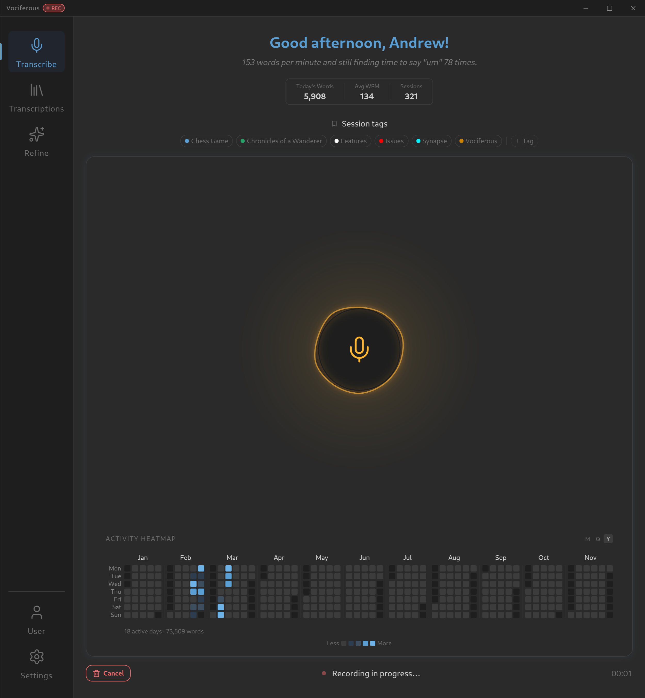
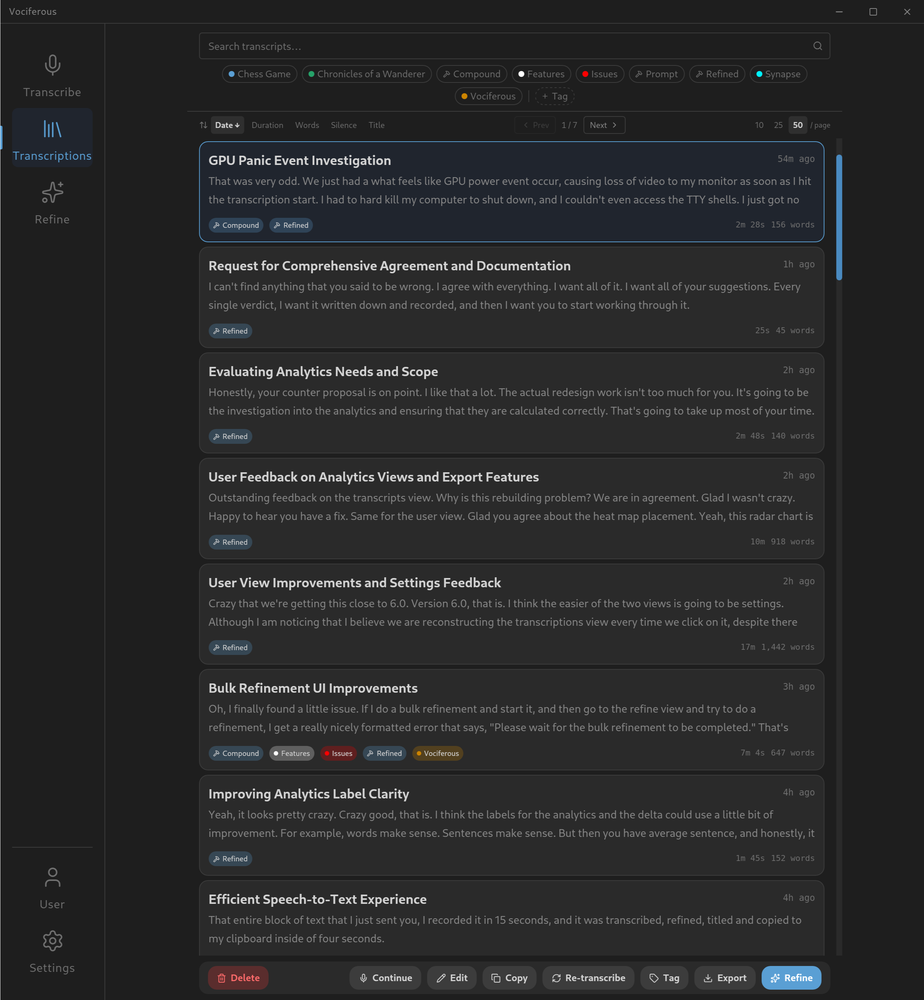
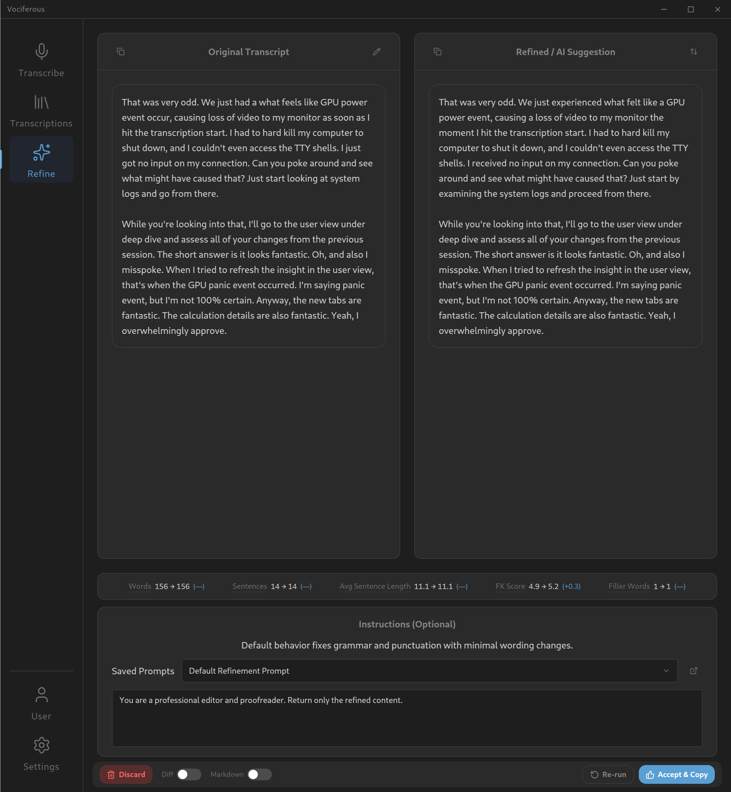
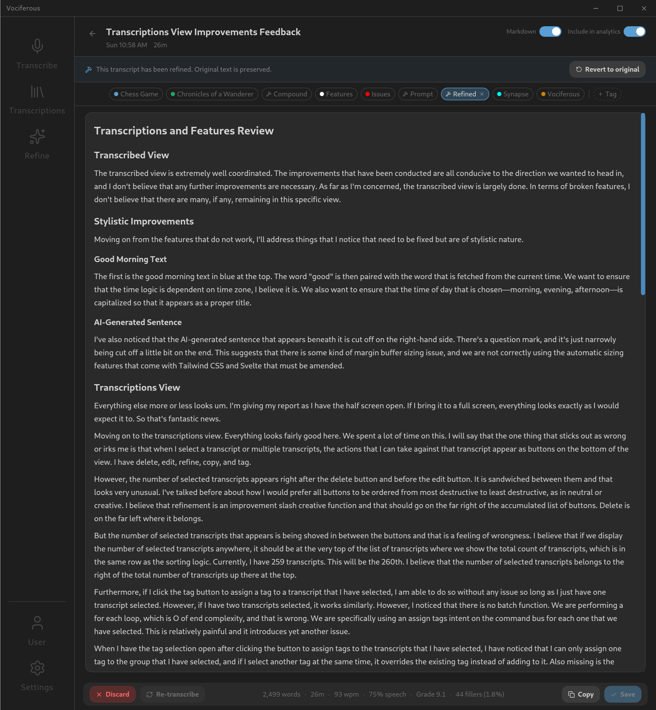
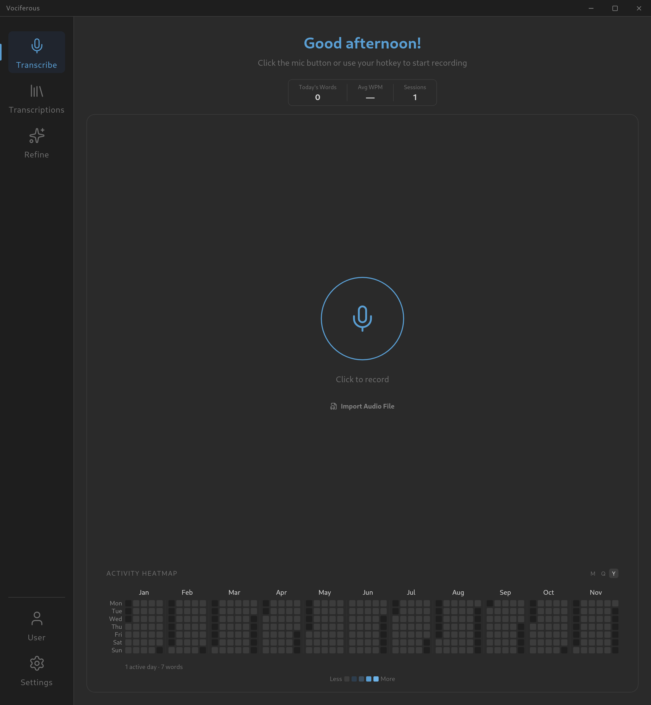
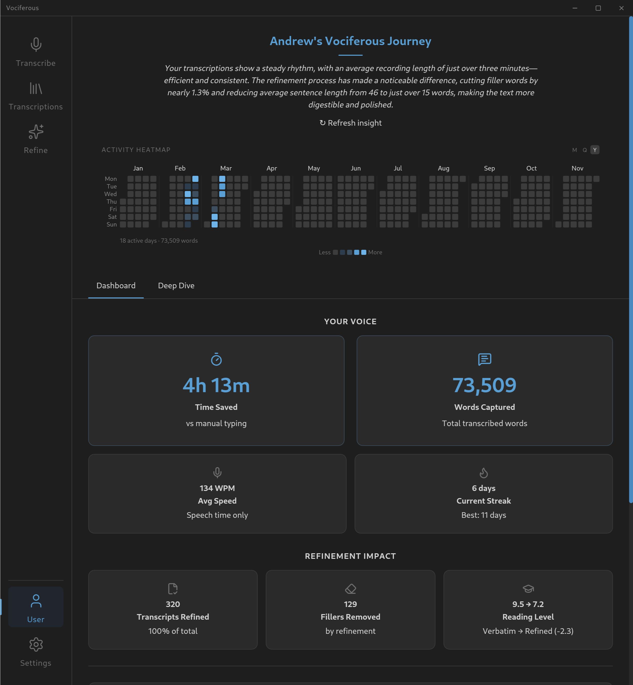

<div align="center">


# Vociferous

**Cross-platform, offline speech-to-text with local AI refinement.**

[](LICENSE)
[](https://python.org)
[](https://svelte.dev)
[](#platform-support)

</div>

---

## Why Vociferous Exists

Vociferous started with a simple problem: I think faster than I type.

Whether I was writing homework, drafting articles on Medium, or trying to get my thoughts in order for a book I've been wanting to write, I needed a way to get ideas out of my head faster than my fingers could manage. Several dictation tools existed on Windows, but nothing worked well across all three major operating systems—and nothing came close to what I needed as a free, open-source solution powered entirely by other open-source software.

What began on September 17, 2025 as a quick passion project called *ChatterBug* to harness the power of [faster-whisper](https://github.com/SYSTRAN/faster-whisper) turned into something I never expected. A complete architectural transformation. A shift in perspective about what I wanted to build and why I wanted to build it. Work didn't begin in earnest until November 21, and the developer I was at that point had no idea how to accomplish what I've since done.

Approaching nearly 1,000 hours invested, Vociferous—*Voci*, as I've come to call it—has transformed my entire work process. It has taught me more about AI, model inference, systems design, frontend engineering, and software architecture than I could have learned any other way. What started as a neat side project has become a production-grade personal productivity system, free for all users.

This program is a hallmark of what I've learned to do and what I'm capable of doing. It's representative of me as a developer. I'm very proud of it.

— **Andrew Brown**, sole developer

---

## What It Does

Vociferous captures audio from your microphone, transcribes it in real-time using [faster-whisper](https://github.com/SYSTRAN/faster-whisper) (CTranslate2 Whisper backend), and optionally refines the output with a local Small Language Model powered by [CTranslate2](https://github.com/OpenNMT/CTranslate2). Everything runs on your hardware — no cloud, no API keys, no data leaves your machine.

Record. Transcribe. Refine. Copy. That's the core loop. The rest is infrastructure to make that loop fast, reliable, and pleasant to use every single day.

---

## Screenshots

<table>
  <tr>
    <td align="center"><strong>Transcribe — Recording</strong></td>
    <td align="center"><strong>Transcriptions Library</strong></td>
  </tr>
  <tr>
    <td></td>
    <td></td>
  </tr>
  <tr>
    <td align="center"><strong>Refine — AI Comparison</strong></td>
    <td align="center"><strong>Edit — Markdown Rendered</strong></td>
  </tr>
  <tr>
    <td></td>
    <td></td>
  </tr>
  <tr>
    <td align="center"><strong>Transcribe — Fresh Install</strong></td>
    <td align="center"><strong>User Dashboard</strong></td>
  </tr>
  <tr>
    <td></td>
    <td></td>
  </tr>
</table>

---

## Features

### Core Workflow
- **Real-time speech-to-text** — Record via mic button or system-wide global hotkey. Transcription runs on a dedicated background thread using faster-whisper with int8 quantization.
- **AI-powered refinement** — Local SLM cleans up grammar, removes filler words, and restructures sentences. Five levels from literal cleanup to full rewrite.
- **Audio file import** — Drag in WAV, MP3, M4A, FLAC, OGG, or WEBM files for transcription.
- **Continue recording** — Append new audio to any existing transcript. Pick up where you left off.
- **Auto-refine** — Optionally refine every new transcription automatically, no clicks required.
- **Copy to clipboard** — One click. That's the whole feature.

### Organization
- **Full-text search** — SQLite FTS5 across all transcript text and titles.
- **Tag system** — Color-coded tags with create, rename, recolor, delete. Filter by ANY or ALL matching tags.
- **Saved prompts** — Store custom refinement instructions as tagged transcripts. Load them in the Refine view.
- **Multi-select** — Ctrl+Click, Shift+Click range selection with bulk operations: delete, refine, tag toggle, export.
- **Export** — Markdown, JSON, CSV, or plain text. Single or batch. Native file dialog.
- **Sortable library** — By date, duration, word count, silence, or title. Paginated with configurable page size.

### Analytics
- **Personal dashboard** — Time saved vs. manual typing, words captured, average speaking speed, recording streaks.
- **Speech quality metrics** — Filler word tracking with per-word breakdown, vocabulary diversity ratio, pause analysis from VAD data.
- **Readability analysis** — Flesch-Kincaid grade level for raw vs. refined text with delta tracking.
- **Processing performance** — Transcription speed (realtime multiplier), SLM throughput (words per minute), inference timing.
- **Activity heatmap** — GitHub-style calendar grid of recording activity.
- **AI-generated insights** — SLM produces personalized observations about your usage patterns.

### Technical
- **100% offline** — No network access required after initial model download. No cloud. No API keys. No telemetry.
- **Cross-platform** — Linux, macOS, and Windows with native window shells.
- **Audio caching** — Configurable on-disk audio buffer (0–480 minutes) for re-transcription after model upgrades.
- **Auto-titling** — SLM generates descriptive titles for new transcripts.
- **Markdown rendering** — Toggle rendered markdown preview in the editor.
- **Configurable hotkey** — Push-to-toggle or hold-to-record modes. Works system-wide via evdev (Linux) or pynput (macOS/Windows).
- **Per-transcript analytics exclusion** — Omit test recordings from your stats.

---

## Platform Support

| Platform | Shell | Status |
|:---------|:------|:-------|
| Linux | GTK + WebKitGTK (pywebview) | **Primary** — actively developed |
| macOS | Cocoa + WebKit (pywebview) | Supported |
| Windows | EdgeChromium (pywebview) | Supported |

## Stack

| Layer | Technology |
|-------|------------|
| Window Shell | [pywebview](https://pywebview.flowrl.com/) |
| Frontend | Svelte 5 + Tailwind CSS v4 + Vite |
| Backend API | Litestar (REST + WebSocket) |
| ASR Engine | faster-whisper (CTranslate2 Whisper backend) |
| SLM Engine | CTranslate2 Generator + tokenizers |
| Database | SQLite with WAL mode + FTS5 |
| Config | Pydantic Settings (JSON persistence, atomic writes) |

---

## Quick Start

### Prerequisites

- Python 3.12+
- Node.js 18+ and npm
- System audio packages (`libportaudio2`, `xclip` on Linux)
- **For GPU acceleration**: NVIDIA driver 550+ with CUDA toolkit (`nvcc`) in PATH

### Linux (Debian/Ubuntu)

```bash
# Full setup: system deps, venv, frontend build, model provisioning
bash scripts/install.sh

# Launch
./vociferous.sh
```

The install script handles everything including interactive model provisioning. If you prefer manual control:

```bash
bash scripts/install.sh    # System deps + venv + frontend build
make provision             # Download models separately
```

### macOS

```bash
bash scripts/install_mac.sh
make provision
./vociferous.sh
```

### Windows

```powershell
# Run from PowerShell as Administrator
.\scripts\install_windows.ps1
.\vociferous.bat
```

### Desktop Shortcuts

| Platform | Install | Remove |
|----------|---------|--------|
| Linux | `make install-desktop` | `make uninstall-desktop` |
| macOS | `make install-shortcut-mac` | `make uninstall-shortcut-mac` |
| Windows | `.\scripts\install_windows_shortcut.ps1` | `.\scripts\uninstall_windows_shortcut.ps1` |

### Docker (Linux only — requires X11/Wayland)

```bash
docker compose build

# Provision models (first run only — persisted in named volume)
docker compose run --rm --entrypoint python3 vociferous scripts/provision_models.py install large-v3-turbo-int8
docker compose run --rm --entrypoint python3 vociferous scripts/provision_models.py install qwen14b

# CPU mode
docker compose up

# NVIDIA GPU mode (requires nvidia-container-toolkit)
docker compose --profile gpu up
```

> Docker requires a display server (Wayland/X11), PulseAudio (or PipeWire compat) for mic access, and `input` group membership for global hotkeys via evdev. See `docker-compose.yml` for environment overrides.

---

## NVIDIA GPU Troubleshooting

### Long Transcription Times (CPU Fallback)

If a 30-second clip takes 2 minutes even with an RTX card, you're on CPU-only wheels.

1. Ensure `nvcc` is in your `$PATH` before running `install.sh`
2. Force rebuild if needed:
    ```bash
    rm -rf .venv
    bash scripts/install.sh
    ```

### UVM Kernel Module Issues (Debian/Ubuntu)

If GPU inference fails with CUDA errors after a kernel update:

```bash
sudo bash scripts/fix_gpu.sh   # or: make fix-gpu
```

This loads the `nvidia-uvm` module, creates the device node, fixes permissions, and verifies CUDA availability.

### WebKitGTK + NVIDIA DRM Workaround

The `vociferous.sh` launcher sets two environment variables to prevent a **kernel panic** caused by the NVIDIA 550.x DRM driver conflicting with WebKitGTK's GPU compositing on Wayland:

```bash
export WEBKIT_DISABLE_COMPOSITING_MODE=1
export WEBKIT_DISABLE_DMABUF_RENDERER=1
```

The GPU is reserved for inference — WebKitGTK doesn't need it.

---

## Architecture

State changes follow the **H-Pattern** (Intent-Driven Interaction):

```
Frontend UI → POST /api/intents → CommandBus → Service Logic → EventBus → WebSocket → Frontend Store
```

- API handlers dispatch Intents — they never call services directly
- The `ApplicationCoordinator` is the Composition Root (owns all lifecycle)
- ASR inference runs in a dedicated background thread (faster-whisper / CTranslate2)
- SLM inference runs in a dedicated background thread with a mutex lock (CTranslate2 Generator)
- The main/UI thread runs pywebview — zero blocking operations allowed

## Project Structure

```
src/
├── api/              # Litestar REST + WebSocket controllers
├── core/             # Application plumbing
│   ├── application_coordinator.py  # Composition Root
│   ├── command_bus.py              # Intent dispatch
│   ├── event_bus.py                # Pub/sub event system
│   ├── settings.py                 # Pydantic configuration
│   ├── handlers/                   # Domain handler classes
│   └── intents/                    # Intent dataclass definitions
├── database/         # SQLite with raw sqlite3 + dataclasses
├── input_handler/    # Global hotkey detection (evdev/pynput)
├── provisioning/     # Model download from HuggingFace Hub
├── refinement/       # SLM inference engine + prompt builder
└── services/         # Audio capture, transcription, SLM runtime

frontend/
├── src/
│   ├── lib/          # Shared components, API client, stores, utilities
│   └── views/        # Page-level Svelte 5 components (6 views)
└── public/           # Static assets

scripts/              # Install, provisioning, GPU fix scripts
tests/                # Unit + integration + contract tests (582 tests)
```

---

## Model Provisioning

Both ASR and SLM use CTranslate2-format models downloaded from HuggingFace Hub.

```bash
make provision    # Interactive model selection
```

Default models:

- **ASR**: `faster-whisper-large-v3-turbo-int8-ct2` (~780 MB)
- **SLM**: `Qwen3-1.7B-ct2-int8` (~1.7 GB)

Models are cached in `~/.cache/vociferous/models/` (XDG-compliant).

---

## Development

```bash
make lint       # Ruff + frontend type check
make format     # Ruff format + frontend format
make test       # pytest (582 tests across 3 tiers)
make build      # Vite production build
make clean      # Remove build artifacts
```

```bash
# Frontend dev server (hot reload)
cd frontend && npm run dev
```

---

## Contributing

This project is maintained by a single developer. Process ceremony is minimal by design.

- Fork, branch, PR — standard GitHub workflow
- Ensure `make lint` and `make test` pass
- Follow the H-Pattern for new features (see `.github/copilot-instructions.md` for architectural invariants)

---

## License

[AGPL-3.0-or-later](LICENSE)

---

## Changelog

See [CHANGELOG.md](CHANGELOG.md) for version history.
